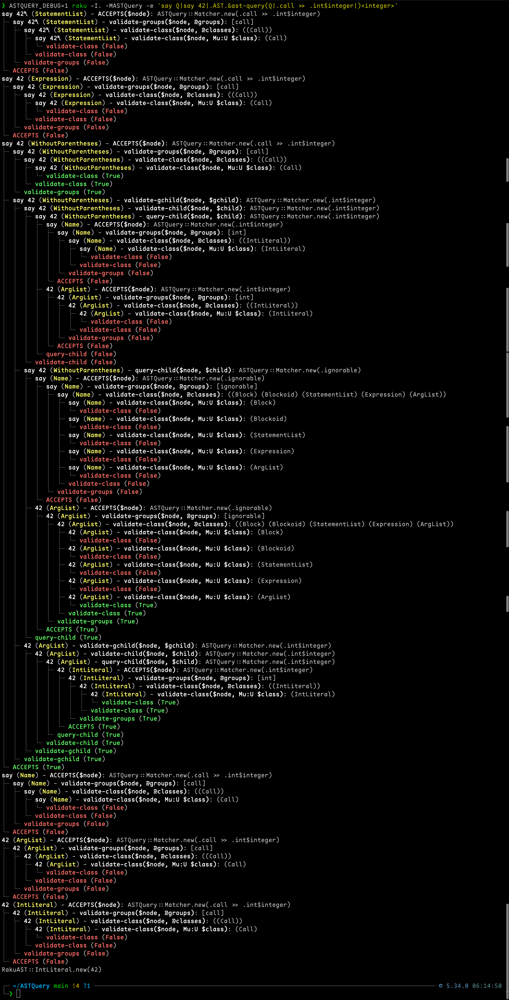

[](https://github.com/FCO/ASTQuery/actions)

NAME
====

ASTQuery - Query and manipulate Raku’s Abstract Syntax Trees (RakuAST) with an expressive syntax

INSTALLATION
============

- Install dependencies (without running tests): `zef install --/test --test-depends --deps-only .`
- Optional tools: `zef install --/test App::Prove6`, `zef install --/test App::RaCoCo`


QUICKSTART
==========

```raku
use ASTQuery;

my $code = q:to/CODE/;
    sub f($x) { }
    f 42;
    say 1 * 3;
CODE

my $ast = $code.AST;

# Find Apply* operator nodes where left=1 and right=3
my $ops = $ast.&ast-query('.apply-operator[left=1, right=3]');
say $ops.list;

# Find calls that have an Int somewhere under args
my $calls = $ast.&ast-query('&is-call[args=>>> .int]');
say $calls.list;
```

DESCRIPTION
===========

ASTQuery provides a compact, composable query language for traversing and matching nodes in Raku’s RakuAST. It lets you precisely match nodes, relationships (child/descendant/ancestor), and attributes, capture interesting nodes, and register custom function matchers for reuse.

Key Features
------------

  * Expressive Query Syntax: Define complex queries to match specific AST nodes.

  * Relationship Operators: Parent/child, ancestor/descendant, and ignorable-skipping variants.

  * Named Captures: Capture matched nodes for easy retrieval.

  * Attribute Matching: Compare values, traverse attributes, and run regexes.

  * Custom Functions: Register reusable matchers referenced with `&name` in queries.

  * CLI Utility: Query files on disk and print results in a readable form.

CLI
===

- Run against a directory or a single file: `raku -I. bin/ast-query.raku 'SELECTOR' [path]`
- If `path` is omitted, scans the current directory recursively.
- Scans extensions: `raku`, `rakumod`, `rakutest`, `rakuconfig`, `p6`, `pl6`, `pm6`.
- Example: `raku -I. bin/ast-query.raku '.call#say >>> .int' lib/`


QUERY LANGUAGE SYNTAX
=====================

Node Description
----------------

Format:

`RakuAST::Class::Name.group#id[attr1, attr2=attrvalue]$name&function`

Components:

  * `RakuAST::Class::Name`: (Optional) Full class name.

  * `.group`: (Optional) Node group (predefined; see Groups).

  * `#id`: (Optional) Identifier value compared against the node’s id field.

  * `[attributes]`: (Optional) Attribute matchers.

  * `$name`: (Optional) Capture name (only one per node part).

  * `&function`: (Optional) Apply a registered function matcher; multiple compose with AND.

Operators
---------

  * `E<gt>` : Left node has the right node as a child.

  * `E<gt>E<gt>` : Left node has the right node as a descendant, with only ignorable nodes between.

  * `E<gt>E<gt>E<gt>`: Left node has the right node as a descendant (any nodes in between).

  * `E<lt>` : Right node is the parent of the left node.

  * `E<lt>E<lt>` : Right node is an ancestor of the left node, with only ignorable nodes between.

  * `E<lt>E<lt>E<lt>`: Right node is an ancestor of the left node (any nodes in between).

Note: The space operator is no longer used.

Attribute Relation Operators
----------------------------

Start traversal from the attribute node (when the attribute value is itself a RakuAST node):

  * `[attr=E<gt> MATCH]` — Child relation from the attribute node to MATCH.

  * `[attr=E<gt>E<gt> MATCH]` — Descendant via ignorable nodes.

  * `[attr=E<gt>E<gt>E<gt> MATCH]` — Descendant allowing any nodes.

Attribute Value Operators
-------------------------

Inside `[attributes]` you can apply value operators to an attribute, comparing against a literal string/number, identifier, or a regex literal:

  * `[attr~= value]` — Contains: substring or regex match on the attribute’s leaf value

  * `[attr^= value]` — Starts-with

  * `[attr$= value]` — Ends-with

  * `[attr*=/regex/]` — Regex match using `/.../` literal

When the attribute value is a RakuAST node, the matcher walks nested nodes via their configured id fields to reach a comparable leaf value (e.g., `.call[name]` → Name’s identifier). Non-existent attributes never match. Flags in regex literals are not yet supported.

Ignorable Nodes
---------------

Nodes skipped by `E<gt>E<gt>` and `E<lt>E<lt>` operators:

  * `RakuAST::Block`

  * `RakuAST::Blockoid`

  * `RakuAST::StatementList`

  * `RakuAST::Statement::Expression`

  * `RakuAST::ArgList`

Function Matchers (`&name`)
===========================

Register reusable matchers in code and reference them in queries via `&name`. Functions compose with other constraints using AND semantics.

- From a selector string: `new-function '&has-int', 'RakuAST::Node >>> .int'`
- From a compiled matcher: `new-function '&f-call', ast-matcher('.call#f')`
- From a Callable: `new-function '&int-is-2', -> $n { $n.^name eq 'RakuAST::IntLiteral' && $n.value == 2 }`


Built-ins registered on module load:

  * `&is-call`, `&is-operator`, `&is-apply-operator`

  * `&is-assignment`, `&is-conditional`

  * `&has-var`, `&has-call`, `&has-int`

Groups (Common Aliases)
=======================

  * `.call` → `RakuAST::Call`

  * `.apply-operator` → `RakuAST::ApplyInfix|ApplyListInfix|ApplyPostfix|Ternary`

  * `.operator` → `RakuAST::Infixish|Prefixish|Postfixish`

  * `.conditional` → `RakuAST::Statement::IfWith|Unless|Without`

  * `.variable`, `.variable-usage`, `.variable-declaration`

  * `.statement`, `.expression`, `.int`, `.str`, `.ignorable`

You can extend these with `add-ast-group` and `add-to-ast-group`.

AST TRANSFORMATIONS
===================

Use ASTQuery in a `CHECK` phaser to rewrite the current compilation unit’s AST before runtime.

- Prereqs: `use experimental :rakuast;`
- Obtain the tree with `$*CU.AST`, mutate nodes, optionally assign back with `$*CU.AST = $ast`.


Example: Replace `say` with `note`
----------------------------------

```raku
use experimental :rakuast;
use ASTQuery;

CHECK {
    my $ast = $*CU.AST;
    my $m = $ast.&ast-query('.call#say$call');
    for $m<call> -> $call {
        CATCH { default { note "say->note rewrite failed: $_" } }
        try $call.name = RakuAST::Name.from-identifier('note');
    }
    $*CU.AST = $ast;
}
```

Example: Change operator `*` to `+`
-----------------------------------

```raku
use experimental :rakuast;
use ASTQuery;

CHECK {
    my $ast = $*CU.AST;
    my $ops = $ast.&ast-query('.apply-operator[infix => RakuAST::Infix#*]$app');
    for $ops<app> -> $app {
        CATCH { default { note "operator rewrite failed: $_" } }
        try $app.infix = RakuAST::Infix.new('+');
    }
    $*CU.AST = $ast;
}
```

note
====

RakuAST remains experimental; if a field is not `rw` on your Rakudo, rebuild the enclosing node as a fallback.

EXAMPLES
========

Example 1: Matching Specific Infix Operations
---------------------------------------------

```raku
# Sample Raku code
my $code = q{
    for ^10 {
        if $_ %% 2 {
            say 1 * 3;
        }
    }
};

# Generate the AST
my $ast = $code.AST;

# Query to find 'apply-operator' nodes where left=1 and right=3
my $result = $ast.&ast-query('.apply-operator[left=1, right=3]');
say $result.list;  # Outputs matching nodes
```

### Output

```raku
[
  RakuAST::ApplyInfix.new(
    left  => RakuAST::IntLiteral.new(1),
    infix => RakuAST::Infix.new("*"),
    right => RakuAST::IntLiteral.new(3)
  )
]
```

Explanation:

  * The query `.apply-operator[left=1, right=3]` matches Apply* nodes with left operand 1 and right operand 3.

Example 2: Using the Ancestor Operator `E<lt>E<lt>E<lt>` and Named Captures
---------------------------------------------------------------------------

```raku
# Sample Raku code
my $code = q{
    for ^10 {
        if $_ %% 2 {
            say $_ * 3;
        }
    }
};

# Generate the AST
my $ast = $code.AST;

# Query to find 'Infix' nodes with any ancestor 'conditional', and capture 'IntLiteral' nodes with value 2
my $result = $ast.&ast-query('RakuAST::Infix <<< .conditional$cond .int#2$int');
say $result.list;  # Infix nodes
say $result.hash;  # Captured nodes under 'cond' and 'int'
```

### Output

```raku
[
  RakuAST::Infix.new("%%"),
  RakuAST::Infix.new("*")
]
{
  cond => [
    RakuAST::Statement::If.new(
      condition => RakuAST::ApplyInfix.new(
        left  => RakuAST::Var::Lexical.new("$_"),
        infix => RakuAST::Infix.new("%%"),
        right => RakuAST::IntLiteral.new(2)
      ),
      then => RakuAST::Block.new(...)
    )
  ],
  int => [
    RakuAST::IntLiteral.new(2),
    RakuAST::IntLiteral.new(2)
  ]
}
```

Explanation:

  * The query `RakuAST::Infix <<< .conditional$cond .int#2$int` matches Infix nodes that have an ancestor matching `.conditional$cond`, regardless of intermediate nodes, and captures `IntLiteral` nodes with value 2 as `$int`.

Example 3: Using the Ancestor Operator `E<lt>E<lt>` with Ignorable Nodes
------------------------------------------------------------------------

```raku
# Find 'Infix' nodes with an ancestor 'conditional', skipping only ignorable nodes
my $result = $ast.&ast-query('RakuAST::Infix << .conditional$cond');
say $result.list;  # Infix nodes
say $result.hash;  # Captured 'conditional' nodes
```

Explanation:

  * The query `RakuAST::Infix << .conditional$cond` matches Infix nodes that have an ancestor `.conditional$cond`, with only ignorable nodes between them.

Example 4: Using the Parent Operator `E<lt>` and Capturing Nodes
----------------------------------------------------------------

```raku
# Sample Raku code
my $code = q{
    for ^10 {
        if $_ %% 2 {
            say $_ * 2;
        }
    }
};

# Generate the AST
my $ast = $code.AST;

# Query to find 'ApplyInfix' nodes where right operand is 2 and capture them as '$op'
my $result = $ast.&ast-query('RakuAST::Infix < .apply-operator[right=2]$op');
say $result<op>;  # Captured 'ApplyInfix' nodes
```

### Output

```raku
[
  RakuAST::ApplyInfix.new(
    left  => RakuAST::Var::Lexical.new("$_"),
    infix => RakuAST::Infix.new("*"),
    right => RakuAST::IntLiteral.new(2)
  )
]
```

Explanation:

  * The query `RakuAST::Infix < .apply-operator[right=2]$op ` matches Apply* nodes with right operand 2 whose parent is an `Infix` node and captures them as `$op`.

Example 5: Using the Descendant Operator `E<gt>E<gt>E<gt>` and Capturing Variables
----------------------------------------------------------------------------------

```raku
# Sample Raku code
my $code = q{
    for ^10 {
        if $_ %% 2 {
            say $_;
        }
    }
};

# Generate the AST
my $ast = $code.AST;

# Query to find 'call' nodes that have a descendant 'Var' node and capture the 'Var' node as '$var'
my $result = $ast.&ast-query('.call >>> RakuAST::Var$var');
say $result.list;  # call nodes
say $result.hash;  # 'Var' node captured as 'var'
```

### Output

```raku
[
  RakuAST::Call::Name::WithoutParentheses.new(
    name => RakuAST::Name.from-identifier("say"),
    args => RakuAST::ArgList.new(
      RakuAST::Var::Lexical.new("$_")
    )
  )
]
{ var => RakuAST::Var::Lexical.new("$_") }
```

Explanation:

  * The query `.call `> RakuAST::Var$var >> matches call nodes that have a descendant `Var` node, regardless of intermediate nodes, and captures the `Var` node as `$var`.

RETRIEVING MATCHED NODES
========================

The `ast-query` function returns an `ASTQuery::Match` object with:

  * `@.list`: Matched nodes.

  * `%.hash`: Captured nodes.

Accessing captured nodes:

```raku
# Perform the query
my $result = $ast.&ast-query('.call#say$call');

# Access the captured node
my $call_node = $result<call>;

# Access all matched nodes
my @matched_nodes = $result.list;
```

PROGRAMMATIC API
================

  * `ast-query($ast, Str $selector)` and `ast-query($ast, $matcher)` — run a query over a RakuAST and return `ASTQuery::Match`.

  * `ast-matcher(Str $selector)` — compile a selector into a matcher object for reuse.

  * `new-function($name, $callable|$matcher|$selector)` — register a function matcher usable as `&name`.

  * `add-ast-group($name, @classes)` / `add-to-ast-group($name, *@classes)` — create or extend group aliases.

  * `set-ast-id($class, $id-method)` — configure which attribute is considered the node’s id field.

GET INVOLVED
============

Visit the [ASTQuery repository](https://github.com/FCO/ASTQuery) on GitHub for examples, updates, and contributions.

How You Can Help
----------------

  * Feedback: Share your thoughts on features and usability.

  * Code Contributions: Add new features or fix bugs.

  * Documentation: Improve tutorials and guides.

Note: ASTQuery is developed by Fernando Corrêa de Oliveira.

DEBUG
=====

Set the `ASTQUERY_DEBUG` env var to see a tree of matcher decisions and deparsed node snippets.



CONCLUSION
==========

ASTQuery empowers developers to effectively query and manipulate Raku’s ASTs, enhancing code analysis and transformation capabilities.

AUTHOR
======

Fernando Corrêa de Oliveira <fernandocorrea@gmail.com>

COPYRIGHT AND LICENSE
=====================

Copyright 2024 Fernando Corrêa de Oliveira

This library is free software; you can redistribute it and/or modify it under the Artistic License 2.0.

